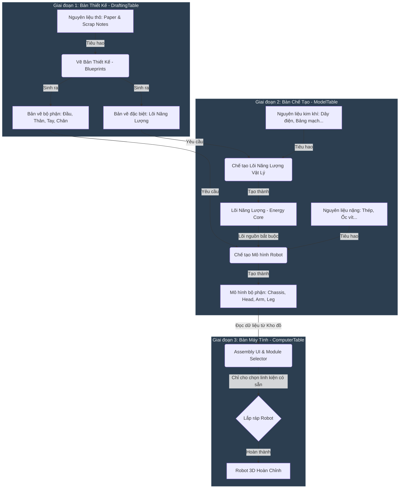

# PHÂN TÍCH & KẾ HOẠCH CẢI TIẾN CHUỖI CHẾ TẠO ROBOT 3 GIAI ĐOẠN

Tài liệu này phân tích tính nhất quán giữa luồng chế tạo (Flow) mong muốn và trạng thái mã nguồn hiện tại trong dự án Unity, từ đó đề xuất lộ trình triển khai chi tiết nhằm tối ưu hóa trải nghiệm người chơi và bảo đảm nguyên tắc Clean Code / SOLID.

---

## 1. Sơ Đồ Luồng Hoạt Động Mong Muốn (Crafting Flow)

---

## 2. Bảng So Sánh & Phân Tích Sai Lệch (Gap Analysis)

| Giai đoạn | Luồng mong muốn (Flow) | Trạng thái hiện tại trong Codebase | Đánh giá & Phát hiện sai lệch |
| :--- | :--- | :--- | :--- |
| **Giai đoạn 1 (Drafting)** | Dùng `Scrap_Notes` và `Technical_Paper` để vẽ toàn bộ Bản vẽ (bao gồm cả Lõi Năng Lượng). | Đã có `DraftingRecipeSO`, `DraftingManager`, `DraftingTableUI`. Các file công thức như `Body_B1.asset`, `Recipes_Energy_Core_Common.asset` đã dùng đúng 2 nguyên liệu này. | **Khớp 100%**. Hệ thống thiết kế bản vẽ đã chạy đúng logic. |
| **Giai đoạn 2 (Chế tạo)** | 1. Dùng Bản vẽ Lõi + Dây/Mạch $\rightarrow$ Lõi Năng lượng vật lý. 2. Dùng Bản vẽ Thân + Lõi nguồn + Thép/Ốc $\rightarrow$ Mô hình Thân (Chassis Model). 3. Dùng Bản vẽ khác + Thép/Ốc $\rightarrow$ Mô hình bộ phận. | Mới chỉ có file thô `ModelTableInteractable.cs` (chứa ghi chú `TODO`). Chưa có logic, UI hay cấu trúc lưu trữ công thức chế tạo. | **Chưa triển khai (Sai lệch lớn)**. Thiếu toàn bộ hệ thống quản lý chế tạo mô hình (Model Crafting System). |
| **Giai đoạn 3 (Lắp ráp)** | Lắp ráp các mô hình thực tế có trong kho đồ thông qua ComputerTable để tạo Robot. | Đã có `ComputerInteractable.cs` (chứa `TODO`), `AssemblyUIBuilder.cs` và `ModuleSelector.cs`. Tuy nhiên, danh sách lắp ráp đang được **hardcode cứng các Prefabs** trong Inspector. | **Sai lệch nghiêm trọng (Lỗ hổng logic)**. `ModuleSelector` cho phép người chơi chọn lắp ráp bất kỳ bộ phận nào có trong danh sách kéo thả của Editor mà **không kiểm tra xem người chơi có thực sự sở hữu mô hình đó trong Inventory** hay không. |

---

## 3. Kế Hoạch Cải Tiến Chi Tiết (Action Plan)

Để đồng bộ mã nguồn khớp hoàn hảo với luồng thiết kế 3 Giai đoạn, chúng ta cần tiến hành cải tiến theo lộ trình sau:

### Bước 1: Khắc phục Giai đoạn 3 - Đồng bộ hóa Bàn Lắp Ráp với Kho đồ
Chúng ta cần sửa đổi `ModuleSelector.cs` để nó không đọc danh sách Prefab vô điều kiện nữa. Nó cần kiểm tra và lọc danh sách dựa trên dữ liệu thực tế từ `InventoryManager`.

1. **Tạo ánh xạ (Mapping)**: Trong `ModuleSelector.cs`, tạo cấu trúc liên kết giữa một `ItemData` (Mô hình vật phẩm trong kho đồ) với `Prefab` lắp ráp tương ứng (ví dụ: `Chassis_B1` (Item) $\rightarrow$ `Chassis_B1_Prefab` (Object)).
2. **Cập nhật hiển thị danh sách**:
   * Sửa hàm `GetModuleCount` và `GetModulePrefabName` trong `ModuleSelector.cs`.
   * Thay vì trả về `chassisPrefabs.Count`, nó sẽ lọc trong `InventoryManager.Instance.slots` xem người chơi có bao nhiêu vật phẩm là **Chassis Model** và chỉ trả về bấy nhiêu tùy chọn.

> [!WARNING]
> Nếu không thực hiện bước này, người chơi có thể bỏ qua hoàn toàn Giai đoạn 1 và Giai đoạn 2 để lắp ráp robot miễn phí trực tiếp từ Bàn Máy Tính.

---

### Bước 2: Triển khai Giai đoạn 2 - Xây dựng Bàn Chế Tạo (Model Table)
Tương tự như cấu trúc sạch của Bàn Thiết Kế, chúng ta sẽ tạo các thành phần sau:

1. **`ModelRecipeSO.cs` (ScriptableObject)**:
   * Lưu công thức chế tạo cho bàn Model Table.
   * Cấu trúc:
     * `ItemData resultModel` (Thành phẩm 3D đầu ra).
     * `ItemData requiredBlueprint` (Bản vẽ bắt buộc phải có trong túi đồ - không bị tiêu hao hoặc có tiêu hao tùy thiết kế).
     * `List<ItemSlot> ingredients` (Danh sách nguyên liệu tiêu hao, ví dụ: 5 Thép, 4 Ốc vít. Riêng công thức Thân sẽ thêm Lõi Năng Lượng vật lý vào đây).
2. **`ModelCraftingManager.cs` (MonoBehaviour - Singleton)**:
   * Quản lý logic chế tạo mô hình.
   * Hàm `CanCraft(ModelRecipeSO recipe)`: Kiểm tra người chơi có sở hữu bản vẽ và đủ nguyên liệu trong `InventoryManager` không.
   * Hàm `CraftModel(ModelRecipeSO recipe)`: Thực hiện trừ nguyên liệu thô (và trừ Lõi năng lượng nếu chế tạo Thân) rồi thêm `resultModel` vào kho đồ.
3. **`ModelTableUI.cs` (UI Controller)**:
   * Giao diện tương tự DraftingTableUI nhưng hiển thị danh sách chế tạo mô hình và yêu cầu nguyên liệu nặng.
4. **Cập nhật `ModelTableInteractable.cs`**:
   * Kích hoạt gọi `ModelTableUI.Instance.OpenUI()` khi tương tác.

---

### Bước 3: Cập nhật dữ liệu Vật phẩm & Công thức thực tế (Unity Configuration)
* Đảm bảo các mô hình thành phẩm như `Body_B1_Model`, `Head_H1_Model`... được tạo dưới dạng `ItemData` với `ItemType = Model`.
* Gán các Lõi năng lượng (`Energy_Core_Common`, `Energy_Core_Rare`...) vào mục nguyên liệu yêu cầu trong công thức chế tạo Thân Robot (`Body_B1_Recipe`, `Body_B2_Recipe`...).

---

**Kế hoạch này đảm bảo tuân thủ nghiêm ngặt nguyên lý SOLID:**
* **S (Single Responsibility)**: Tách biệt hoàn toàn logic thiết kế bản vẽ (Drafting), chế tạo mô hình (Model Crafting) và lắp ráp tổng thể (Assembly).
* **D (Dependency Inversion)**: Hệ thống lắp ráp phụ thuộc vào dữ liệu trừu tượng của Kho đồ (`InventoryManager`) thay vì các danh sách cứng tự định nghĩa.
